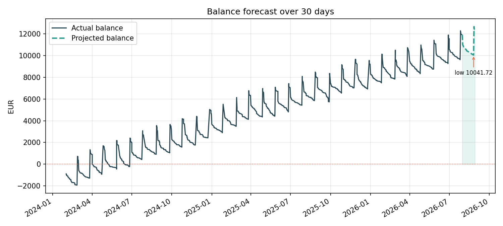

# fintrack

A command line tool and Python library that turns a plain CSV export of bank
transactions into something useful: a list of the payments that repeat every
month, a day-by-day projection of the account balance, and concrete
recommendations for where money could be saved.

The problem it solves is a boring but real one. Bank apps show you a list of
bookings and, at best, a pie chart. They rarely tell you *which* of your
payments are actually recurring commitments, what those commitments cost per
year, or whether your balance is going to survive the next three months. This
package answers those three questions.

```
Detected recurring payments
------------------------------------------------------------------------------
Description                   Period      Amount  Per month  Seen    Next due  Conf.
Arbeitgeber GmbH Gehalt       monthly    2635.78    2635.78    30  2026-08-27    97%
Hausverwaltung Mueller Miete  monthly    -895.00    -895.00    30  2026-08-01    98%
Sparplan ETF Depot Transfer   monthly    -300.00    -300.00    30  2026-08-28    98%
Barmenia Versicherung         monthly     -78.50     -78.50    30  2026-08-10    98%
Stadtwerke Dortmund Strom     monthly     -63.67     -63.67    30  2026-08-03    87%
VRR Abo Ticket                quarterly   -89.40     -29.47    10  2026-08-06    99%
Netflix.com                   monthly     -12.99     -12.99    30  2026-08-17    97%
Domain Hosting Rechnung       yearly     -119.00      -9.78     3  2027-02-16    90%
```

## Features

- **Forgiving CSV import.** Detects the delimiter, the column names (English or
  German), the date format and the decimal separator, so a raw bank export
  usually works without editing. `1.234,56` and `1,234.56` are both understood.
- **Recurring payment detection.** Groups bookings by a normalised merchant
  key, then checks whether the gaps between them snap onto a weekly, biweekly,
  monthly, quarterly or yearly rhythm and whether the amounts are stable
  enough. Each series gets a confidence score, a next due date and its cost
  normalised to a month and a year.
- **Balance forecasting.** Projects the balance forward day by day by placing
  the detected recurring items on their expected dates and adding an average
  daily rate for everything irregular. Reports the low point and warns about a
  projected overdraft.
- **Rule-based categorisation.** Ships with sensible defaults for common
  merchants; rules can be extended in code or loaded from a JSON file.
- **Textual recommendations.** Savings rate assessment, the collective cost of
  small subscriptions, categories that grew unusually in the last month, annual
  charges worth saving up for, and liquidity warnings.
- **Charts.** Four Matplotlib figures written to PNG files (nothing is
  displayed interactively, so it works over SSH and in CI).

## Installation

Requires Python 3.10 or newer.

```bash
git clone <YOUR-PUBLIC-GITHUB-REPOSITORY-URL>
cd fintrack
uv pip install -e .
```

For the test suite and the linter:

```bash
uv pip install -e ".[dev]"
```

## Usage

The package ships with a synthetic 30-month example dataset, so every command
below works immediately after installation without supplying any data.

```bash
# Full report plus charts, written to ./output
uv run -m fintrack analyze --days 90 --charts --save-report

# Only the recurring payments
uv run -m fintrack recurring

# Spending per category, optionally for a single month
uv run -m fintrack categories
uv run -m fintrack categories --month 2026-05

# Balance projection starting from a balance you type in
uv run -m fintrack forecast --days 120 --balance 2400.00

# Write a fresh synthetic dataset you can experiment with
uv run -m fintrack generate-sample -o my_transactions.csv --months 24
```

To use your own data, pass `--file`:

```bash
uv run -m fintrack analyze --file path/to/export.csv --charts
```

### Expected CSV format

The importer needs a header row containing a date, a description and an amount
column. It recognises these names (case insensitive):

| Field | Accepted headers |
| --- | --- |
| date (required) | `date`, `datum`, `booking date`, `buchungstag`, `transaction date`, `valuta` |
| description (required) | `description`, `text`, `purpose`, `beschreibung`, `verwendungszweck`, `payee`, `name` |
| amount (required) | `amount`, `betrag`, `value`, `sum`, `umsatz` |
| account (optional) | `account`, `konto`, `iban` |
| category (optional) | `category`, `kategorie`, `type` |

Expenses are negative, income is positive. A minimal file looks like this:

```csv
date,description,amount
2026-05-01,Hausverwaltung Mueller Miete,-895.00
2026-05-27,Arbeitgeber GmbH Gehalt,2640.00
```

### All command line options

```
fintrack [-h] [--version] {analyze,recurring,categories,forecast,generate-sample} ...

  -f, --file PATH        CSV file with transactions (default: bundled example)
  --rules PATH           JSON file with custom category rules
  --encoding ENC         text encoding of the CSV file (default: utf-8)

analyze   --days N --balance X --charts -o DIR --save-report
recurring
categories --month YYYY-MM
forecast  --days N --balance X --show-days N
generate-sample -o FILE --months N --seed N
```

## Using it as a library

Every part of the analysis is importable; the CLI is only a thin wrapper.

```python
import fintrack

transactions = fintrack.load_transactions("my_export.csv")
transactions = fintrack.Categorizer().categorize_all(transactions)

series = fintrack.detect_recurring(transactions)
for item in series:
    print(item.label, item.period_label, item.monthly_equivalent, item.next_due)

forecast = fintrack.forecast_balance(transactions, horizon_days=90, starting_balance="2400")
print(forecast.ending_balance, forecast.first_negative)

summaries = fintrack.monthly_summaries(transactions)
for advice in fintrack.generate_recommendations(summaries, series, forecast):
    print(advice)
```

Adding your own categorisation rules:

```python
categorizer = fintrack.Categorizer()
categorizer.add_rule("Groceries", "Trinkgut", "Getraenkemarkt")
categorizer.add_rule("Hobbies", "Thomann", "Kletterhalle")
transactions = categorizer.categorize_all(transactions, overwrite=True)
```

`examples/showcase.ipynb` walks through the same workflow in a notebook.

## Generated output

Running `uv run -m fintrack analyze --charts --save-report` writes these files
into `output/` (all of them are committed in this repository as examples):

| File | Content |
| --- | --- |
| [`output/monthly_cashflow.png`](output/monthly_cashflow.png) | Income, expenses and net result per month |
| [`output/category_breakdown.png`](output/category_breakdown.png) | Total spending per category |
| [`output/recurring_overview.png`](output/recurring_overview.png) | Each recurring item normalised to a monthly cost |
| [`output/balance_forecast.png`](output/balance_forecast.png) | Historic running balance plus the projection |
| [`output/report.txt`](output/report.txt) | The full text report |



## How the detection works

The interesting part of the package is `fintrack/recurring.py`.

1. **Normalise.** Descriptions are lowercased, digits and punctuation are
   stripped and generic banking vocabulary (`sepa`, `lastschrift`, `gmbh`, ...)
   is removed, so `SEPA Lastschrift NETFLIX.COM 4711` and `Netflix.com 0815`
   collapse to the same key.
2. **Group and measure.** Within each group the gaps between consecutive
   bookings are measured. The median gap is snapped onto one of the known
   periods (7, 14, 30, 91 or 365 days) with a relative tolerance.
3. **Check stability.** The relative standard deviation of the amounts must
   stay below a tolerance, which is what separates a monthly electricity bill
   (varies a little) from weekly grocery shopping (varies wildly).
4. **Score.** Confidence combines gap regularity, amount consistency and the
   number of observed occurrences. Series below the threshold are dropped.
5. **Project forward.** Monthly items advance by calendar month rather than by
   30 days, so a payment on the 31st does not slowly drift through the month.

## Project structure

```
fintrack/
├── pyproject.toml
├── README.md
├── examples/
│   └── showcase.ipynb          # notebook walkthrough
├── output/                     # committed example charts and report
├── src/fintrack/
│   ├── __init__.py             # public API re-exports
│   ├── __main__.py             # entry point for `uv run -m fintrack`
│   ├── cli.py                  # argparse interface, one function per command
│   ├── models.py               # Transaction, RecurringSeries, Forecast, ...
│   ├── loading.py              # CSV import and export
│   ├── categorization.py       # keyword based categorisation
│   ├── summary.py              # monthly and per-category aggregation
│   ├── recurring.py            # recurring payment detection
│   ├── forecasting.py          # balance projection
│   ├── advice.py               # recommendation generation
│   ├── reporting.py            # text report and table rendering
│   ├── visualization.py        # Matplotlib charts
│   ├── sample_data.py          # synthetic dataset generator
│   └── data/
│       └── sample_transactions.csv
└── tests/                      # 86 tests
```

## Dataset

No real bank data is used. `src/fintrack/data/sample_transactions.csv` is a
synthetic 30-month history of roughly 1000 bookings (about 60 KB), generated by
`fintrack/sample_data.py` with a fixed seed so results are reproducible. It
contains twelve recurring items — salary, rent, electricity, internet, mobile,
insurance, two streaming subscriptions, a gym membership, a savings transfer, a
quarterly transport pass and a yearly invoice — plus irregular day-to-day
spending at a dozen merchants. Regenerate it with:

```bash
uv run -m fintrack generate-sample -o src/fintrack/data/sample_transactions.csv --months 30
```

## Submission checklist

Before handing the project in on Moodle:

1. Create a **public** GitHub repository named `fintrack` (or another name you prefer).
2. Push this project and keep a meaningful commit history that reflects your own development process.
3. Replace `<YOUR-PUBLIC-GITHUB-REPOSITORY-URL>` in the installation example with your repository URL.
4. Verify that `uv pip install -e .` succeeds and that `uv run -m fintrack --help` works.
5. Submit the public GitHub repository URL on Moodle.

## Development

```bash
uv pip install -e ".[dev]"
pytest          # run the test suite
ruff check .    # lint
ruff format .   # format
```

The test suite contains 86 tests and covers amount and date parsing across formats, categorisation
precedence, the recurring detector on both clean and deliberately noisy input,
period arithmetic across month boundaries, forecast behaviour including
overdraft detection, and every CLI sub-command.

## License

MIT, see [LICENSE](LICENSE).
